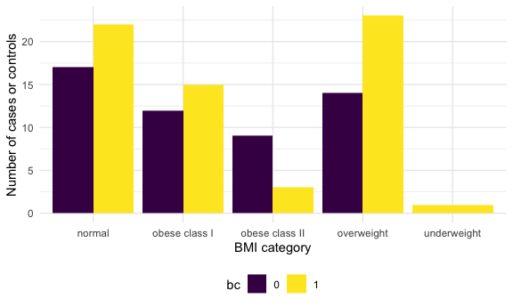

Homework 0: Pre-Course Assignment
================
Megan Marziali
January 3, 2021

This document contains a solution for the pre-course assignment for EPID
P8451.

``` r
library(tidyverse)
library(arsenal)
library(ggplot2)

knitr::opts_chunk$set(
  fig.width = 6,
  fig.asp = 0.6,
  out.width = "90%"
)

theme_set(theme_minimal() + theme(legend.position = "bottom"))

options(
  ggplot2.continuous.colour = "viridis",
  ggplot2.continuous.fill = "viridis"
)

scale_colour_discrete = scale_color_viridis_d
scale_fill_discrete = scale_fill_viridis_d
```

## Question 1: Summary Table

The code chunk below imports and cleans the data.

``` r
bc_data = 
  read_csv("./data/bcdata_Assignment1.csv",
           na = "") %>% 
  janitor::clean_names() %>% 
  mutate(
    classification = as.factor(classification),
    bc = recode(
      classification, 
      "1" = "0", 
      "2" = "1"))
```

The dataset contains 10 variables and 116 observations.

The code chunk below creates a summary table of the quantitative
features of the dataset.

``` r
table_one = tableby(~ age + bmi + glucose + insulin
                    + homa + leptin + adiponectin 
                    + resistin + mcp_1, data = bc_data,
                    numeric.stats = c("mean","median", "range"))

summary(table_one)
```

|                 |  Overall (N=116)  |
| :-------------- | :---------------: |
| **age**         |                   |
| Mean            |      57.302       |
| Median          |      56.000       |
| Range           |  24.000 - 89.000  |
| **bmi**         |                   |
| Mean            |      27.582       |
| Median          |      27.662       |
| Range           |  18.370 - 38.579  |
| **glucose**     |                   |
| Mean            |      97.793       |
| Median          |      92.000       |
| Range           | 60.000 - 201.000  |
| **insulin**     |                   |
| Mean            |      10.012       |
| Median          |       5.925       |
| Range           |  2.432 - 58.460   |
| **homa**        |                   |
| Mean            |       2.695       |
| Median          |       1.381       |
| Range           |  0.467 - 25.050   |
| **leptin**      |                   |
| Mean            |      26.615       |
| Median          |      20.271       |
| Range           |  4.311 - 90.280   |
| **adiponectin** |                   |
| Mean            |      10.181       |
| Median          |       8.353       |
| Range           |  1.656 - 38.040   |
| **resistin**    |                   |
| Mean            |      14.726       |
| Median          |      10.828       |
| Range           |  3.210 - 82.100   |
| **mcp\_1**      |                   |
| Mean            |      534.647      |
| Median          |      471.322      |
| Range           | 45.843 - 1698.440 |

## Question 2: Recoding BMI

The code chunk below will recode BMI into the WHO defined categories.

``` r
bc_data_rec =   
  bc_data %>% 
  mutate(
    bmi_cat = case_when(bmi < 16.5 ~ "severely underweight", 
                        bmi < 18.5 ~ "underweight",
                        bmi >= 18.5 & bmi < 25 ~ "normal",
                        bmi >= 25 & bmi < 30 ~ "overweight",
                        bmi >= 30 & bmi < 35 ~ "obese class I",
                        bmi >= 35 & bmi < 40 ~ "obese class II",
                        bmi >= 40 ~ "obese class III"))
```

## Question 3: Bar Chart

The code below creates a bar chart representing the cases and controls
of breast cancer per BMI category. The legend denotes breast cancer
classifications, where 0 corresponds to healthy controls and 1
corresponds to cases.

``` r
bc_data_rec %>% 
  group_by(bc, bmi_cat) %>% 
  count(bc) %>% 
  ggplot(aes(x = bmi_cat, y = n, fill = bc)) + 
    geom_bar(position = "dodge", stat = "identity") +
    labs(x = "BMI category",
         y = "Number of cases or controls")
```



## Question 4: Logistic Regression

The code below runs a logistic regression model with breast cancer as
the outcome and glucose, HOMA, leptin, BMI and age as the independent
variables. The beta estimate, OR and 95% confidence intervals are
presented for a one-unit change in HOMA.

``` r
glm(bc ~ glucose + homa + leptin + bmi + age, data = bc_data, family = binomial()) %>% 
  broom::tidy() %>% 
  mutate(
    OR = exp(estimate),
    CI_lower = exp(estimate - 1.96 * std.error),
    CI_upper = exp(estimate + 1.96 * std.error)
  ) %>% 
  select(term, estimate, OR, starts_with("CI")) %>% 
  filter(str_detect(term, "homa")) %>% 
  mutate(
    term = str_replace(term, "homa", "HOMA: ")) %>% 
  knitr::kable(digits = 3)
```

| term  | estimate |    OR | CI\_lower | CI\_upper |
| :---- | -------: | ----: | --------: | --------: |
| HOMA: |    0.274 | 1.315 |     0.939 |     1.842 |

## Question 5: Linear Regression

The code below runs a linear regression model with insulin as the
outcome and BMI, age, and glucose as the independent variables. The
estimate and 95% confidence intervals for a one-unit change in age are
presented.

``` r
lm(insulin ~ bmi + age + glucose, data = bc_data) %>% 
  broom::tidy() %>% 
  mutate(
    CI_lower = exp(estimate - 1.96 * std.error),
    CI_upper = exp(estimate + 1.96 * std.error)
  ) %>% 
  select(term, estimate, starts_with("CI")) %>% 
  filter(str_detect(term, "age")) %>% 
  mutate(
    term = str_replace(term, "age", "Age: ")) %>% 
  knitr::kable(digits = 3)
```

| term | estimate | CI\_lower | CI\_upper |
| :--- | -------: | --------: | --------: |
| Age: |  \-0.054 |     0.856 |     1.049 |
